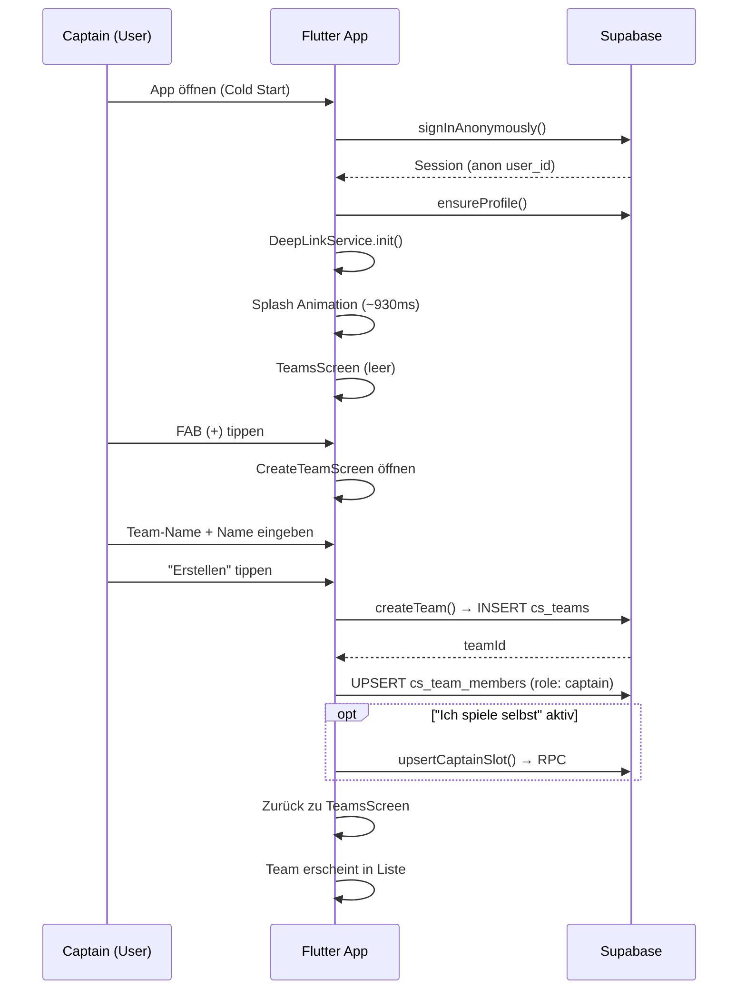
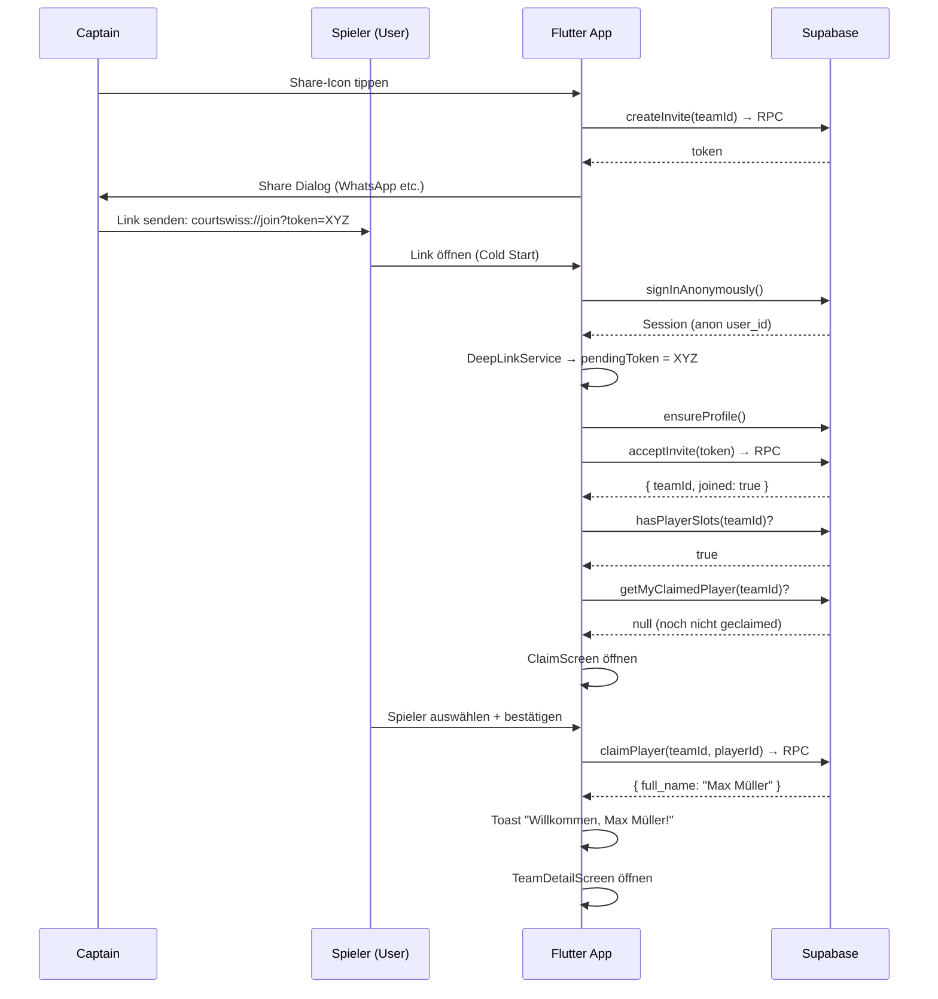

# Onboarding – IST-Zustand (Current State)

> **Stand:** Februar 2026
> **Scope:** Auth, Team-Erstellung, Invite-Flow, Claim-Flow, Captain vs. Spieler
> **Hinweis:** Dieses Dokument beschreibt ausschließlich den aktuellen Zustand – keine Vorschläge, keine Refactors.

---

## Inhaltsverzeichnis

1. [Auth Flow – Captain (Team-Ersteller)](#1-auth-flow--captain-team-ersteller)
2. [Auth Flow – Eingeladener Spieler (Share Link)](#2-auth-flow--eingeladener-spieler-share-link)
3. [Claim / Zuordnung](#3-claim--zuordnung)
4. [Unterschiede Captain vs. Spieler](#4-unterschiede-captain-vs-spieler)
5. [Sequenz-Diagramm](#5-sequenz-diagramm)
6. [Offene Fragen / Risiken](#6-offene-fragen--risiken)

---

## 1. Auth Flow – Captain (Team-Ersteller)

### 1.1 App-Start (Cold Start)

1. **`main()`** wird ausgeführt (`lib/main.dart`)
2. Flutter-Binding, `.env`, Firebase und Supabase werden initialisiert
3. **Anonymous Auth:** Wenn keine bestehende Session existiert, wird sofort `signInAnonymously()` aufgerufen → der User erhält eine anonyme Supabase-Session mit einer `user_id`
4. **DeepLinkService** wird initialisiert (prüft auf initialen Deep Link + horcht auf zukünftige Links)
5. **Local Notifications** werden initialisiert (Permission-Request)
6. `MyApp` wird gestartet → zeigt `CsSplashOverlay` (Logo-Animation ~930ms) über `AuthGate`

### 1.2 Auth-Status-Logik (`AuthGate`)

- `AuthGate` (`lib/screens/auth_gate.dart`) ist ein `StreamBuilder` auf `onAuthStateChange`
- **Session vorhanden** (immer der Fall, da Anonymous Auth in `main()`) → `LoggedInScreen` wird angezeigt
- **Keine Session** (Sicherheitsnetz, sollte nicht eintreten) → Ladekreis wird angezeigt

### 1.3 LoggedInScreen – Initialisierung

1. `ProfileService.ensureProfile()` → Upsert in `cs_app_profiles` (user_id, email, display_name)
   - Bei anonymen Usern: `email = null`, `display_name = "Spieler"`
2. `PushService.initPush()` → FCM-Token registrieren, Foreground-Listener starten
3. Prüfung auf `pendingToken` (Deep Link, der vor Login einging) → ggf. `_acceptInviteToken()`
4. `_listenForInviteTokens()` → Stream-Listener für eingehende Invite-Tokens während die App läuft
5. `_subscribeNotifications()` → Realtime-Subscription auf In-App-Notifications

### 1.4 TeamsScreen – Startseite

- `LoggedInScreen.build()` gibt `TeamsScreen` zurück
- `TeamsScreen` lädt via `TeamService.listMyTeams()` alle Teams, bei denen der User Mitglied ist (Abfrage über `cs_team_members`)
- **Leerer Zustand:** "Willkommen bei CourtSwiss" mit Quick-Start-Guide
- **FAB (Floating Action Button):** Immer sichtbar → führt zu `CreateTeamScreen`

### 1.5 Team erstellen (Captain wird)

1. Captain tippt auf **FAB (+)** → `CreateTeamScreen` öffnet sich
2. Pflichtfelder:
   - **Club Name / Team Name** (Pflicht)
   - **Dein Name im Team** (Pflicht, min. 2 Zeichen, max. 30)
   - Saison-Jahr (vorausgefüllt mit aktuellem Jahr)
   - Liga (optional, vorausgefüllt mit "3. Liga Herren")
3. Toggle: **"Ich spiele selbst"**
   - Falls aktiviert: Ranking-Auswahl wird eingeblendet (Land + Ranking-Wert, Pflicht)
4. Bei Submit:
   - `TeamService.createTeam()` → Insert in `cs_teams` + Upsert in `cs_team_members` mit `role: 'captain'`, `is_playing: false`
   - Falls "Ich spiele selbst" aktiv: `TeamPlayerService.upsertCaptainSlot()` → RPC `upsert_captain_player_slot` (auto-claimed, mit Ranking)
5. Zurück zu `TeamsScreen` → Team erscheint in der Liste

### 1.6 Magic Link Flow (Captain)

- `LoginScreen` existiert (`lib/screens/auth_screen.dart`), wird aber **aktuell nirgends navigiert** – es gibt keinen Button/Link in der App, der zu diesem Screen führt
- `LoginScreen` sendet einen Magic Link via `signInWithOtp(email, emailRedirectTo: 'io.courtswiss://login')`
- Der Redirect-URL-Scheme `io.courtswiss://login` wird vom `DeepLinkService` als Auth-Callback ignoriert (nicht als Invite behandelt)
- Supabase PKCE-Flow (`AuthFlowType.pkce`) ist konfiguriert
- **Fazit:** Magic Link ist implementiert, aber derzeit nicht über die UI erreichbar. Alle User starten als anonyme User.

### 1.7 Wann gilt ein User als „Captain"?

- Sobald er ein Team erstellt (`TeamService.createTeam()`)
- In `cs_team_members` wird der Eintrag mit `role: 'captain'` gespeichert
- Die Captain-Prüfung erfolgt über:
  ```dart
  _members.any((m) => m['user_id'] == uid && m['role'] == 'captain')
  ```
- Zusätzlich: `widget.team['created_by'] == uid` wird als Fallback geprüft (in `TeamDetailScreen`)

### 1.8 Wann ist Onboarding für Captain abgeschlossen?

- Implizit nach Team-Erstellung: Team existiert, Captain ist Mitglied
- Es gibt **keinen expliziten Onboarding-Complete-Status** oder Flag
- Nächste erwartete Schritte (nicht erzwungen): Spieler hinzufügen → Invite-Link teilen → Spiel erstellen

---

## 2. Auth Flow – Eingeladener Spieler (Share Link)

### 2.1 Invite-Link-Erstellung (Captain-Seite)

1. Captain öffnet `TeamDetailScreen` → tippt auf Share-Icon in der AppBar
2. `InviteService.createInvite(teamId)` → RPC `create_team_invite` → gibt Token zurück
3. Share-Text wird generiert:
   ```
   Tritt meinem Interclub-Team "TC Winterthur" bei CourtSwiss bei:
   courtswiss://join?token=<TOKEN>
   ```
4. Nativer Share-Dialog öffnet sich (z.B. WhatsApp, SMS)

### 2.2 Link-Formate

| Typ | Format | Status |
|---|---|---|
| Custom Scheme | `courtswiss://join?token=<TOKEN>` | **Aktiv** |
| Universal Link | `https://courtswiss.app/join?token=<TOKEN>` | **Vorbereitet, aber auskommentiert** (Android Manifest) |

### 2.3 Öffnen des Invite-Links

#### Szenario A: App installiert, Cold Start

1. User tippt auf Link → App wird gestartet
2. `main()` läuft ab → Anonymous Auth → Session existiert
3. `DeepLinkService.init()` prüft `getInitialLink()` → findet den Invite-Link
4. `_handleUri()` extrahiert `token` aus Query-Parametern
5. Token wird als `_pendingToken` gespeichert UND über `_tokenController` gestreamt
6. `LoggedInScreen._init()` findet `pendingToken` → ruft `_acceptInviteToken(token)` auf

#### Szenario B: App installiert, bereits im Vordergrund (Warm Start)

1. User tippt auf Link → App wird in den Vordergrund geholt
2. `DeepLinkService._sub` (uriLinkStream) empfängt die URI
3. Token wird gestreamt → `LoggedInScreen._listenForInviteTokens()` empfängt ihn
4. `_acceptInviteToken(token)` wird aufgerufen

#### Szenario C: App NICHT installiert

- Der Custom-Scheme-Link (`courtswiss://...`) funktioniert nur mit installierter App
- Ohne App passiert **nichts** bzw. OS zeigt Fehler an
- Universal Links (`https://courtswiss.app/...`) sind vorbereitet, aber noch nicht aktiv

### 2.4 Verarbeitung des Invite-Tokens (`_acceptInviteToken`)

```
1. InviteService.acceptInvite(token) → RPC `accept_team_invite`
   → Gibt zurück: { teamId, joined }
   → Server-seitig: Insert in cs_team_members (role: 'member')

2. Falls joined == false:
   → Toast: "Du bist bereits Mitglied dieses Teams"
   → Ende

3. Falls joined == true:
   a. Navigation wird auf Root zurückgesetzt (popUntil isFirst)
   b. TeamsScreen wird neu gebaut (_refreshCounter++)
   c. Prüfung: Hat das Team Player-Slots? (TeamPlayerService.hasPlayerSlots)
   d. Prüfung: Hat der User bereits einen Slot geclaimed? (getMyClaimedPlayer)

   WENN Player-Slots vorhanden UND noch nicht geclaimed:
      → Team-Daten laden (cs_teams)
      → Navigation zu ClaimScreen
      → Falls User Claiming überspringt → Mandatory Name Dialog
      → Falls User erfolgreich claimed → Toast "Spieler zugeordnet"
      → Navigation zu TeamDetailScreen

   WENN keine Player-Slots ODER bereits geclaimed:
      → Mandatory Name Dialog (blockierend, nicht schließbar)
      → Navigation zu TeamDetailScreen
```

### 2.5 Verhalten ohne Login / mit bestehender Session

- **Ohne Login:** Ist nicht möglich – `main()` erstellt immer eine anonyme Session bevor die UI geladen wird. Jeder User hat immer eine Session.
- **Mit bestehender Session:** Der Invite wird einfach mit der aktuellen `user_id` angenommen. Es gibt keine Unterscheidung zwischen anon und authentifiziert.

### 2.6 Magic Link für Invite-User

- Es gibt aktuell **keinen Magic-Link-Flow für eingeladene Spieler**
- Alle Spieler agieren mit anonymer Session
- `LoginScreen` ist nicht in die Navigation eingebunden

### 2.7 Wann wird der Spieler dem Team zugeordnet?

- Sofort bei `InviteService.acceptInvite(token)` → Server-seitige Logik (`accept_team_invite` RPC) erstellt den Eintrag in `cs_team_members` mit `role: 'member'`

### 2.8 Wann gilt ein Spieler als „verbunden"?

- Ein Spieler ist Mitglied, sobald der Invite akzeptiert wurde (`cs_team_members`-Eintrag existiert)
- Ein Spieler gilt als **zugeordnet/verbunden** im engeren Sinne, wenn er einen Player-Slot geclaimed hat (`cs_team_players.claimed_by = user_id`)
- Die Sichtbarkeit im UI:
  - **Geclaimed:** Grüner Chip „Verbunden" am Player-Slot in der Team-Ansicht
  - **Nicht geclaimed:** Chip „Offen" am Player-Slot

---

## 3. Claim / Zuordnung

### 3.1 Was ist Claiming?

Claiming verbindet einen authentifizierten User (seine `user_id`) mit einem vom Captain vorab angelegten Spieler-Slot (`cs_team_players`). Der Captain erstellt Slots mit Vorname, Nachname und optionalem Ranking. Der eingeladene Spieler wählt aus der Liste seinen eigenen Namen.

### 3.2 Ablauf im Detail

1. **Voraussetzung:** Captain hat Player-Slots erstellt (über „Spieler hinzufügen" im Team-Tab)
2. **Trigger:** Nach `acceptInvite()` – wenn Slots vorhanden und User noch keinen geclaimed hat
3. **ClaimScreen** (`lib/screens/claim_screen.dart`):
   - Zeigt Team-Name und Anleitung: „Wähle deinen Namen aus der Liste"
   - Lädt alle unclaimed Slots via `TeamPlayerService.listUnclaimedPlayers(teamId)`
   - Optional: Suchfeld (bei > 5 Spielern)
   - User tippt auf einen Namen → Bestätigungs-BottomSheet: "Bist du «Max Müller · R7»?"
   - Bei Bestätigung: `TeamPlayerService.claimPlayer(teamId, playerId)` → RPC `claim_team_player`
   - RPC setzt `claimed_by = auth.uid()` auf dem Player-Slot (atomar)
   - Gibt `full_name` zurück → Toast "Willkommen, Max Müller!"
   - `Navigator.pop(context, true)` → zurück zu `_acceptInviteToken` mit `claimed = true`
4. **Überspringen möglich:** "Überspringen"-Button in der AppBar
   - `Navigator.pop(context, false)` → Fallback: Mandatory Name Dialog wird angezeigt
   - User gibt manuell einen Namen ein → `MemberService.updateMyNickname(teamId, name)` → Update auf `cs_team_members.nickname`

### 3.3 Verwendete Daten

| Tabelle | Feld | Beschreibung |
|---|---|---|
| `cs_team_players` | `first_name`, `last_name` | Vom Captain angelegt |
| `cs_team_players` | `ranking` | Optional, numerischer Wert |
| `cs_team_players` | `claimed_by` | `user_id` des Users, der den Slot beansprucht hat. `null` = offen |
| `cs_team_members` | `nickname` | Fallback-Name, wenn User keinen Slot claimed |
| `cs_team_members` | `role` | `captain` oder `member` |

### 3.4 Sichtbarkeit im UI

- **TeamDetailScreen → Team-Tab:**
  - Jeder Player-Slot zeigt:
    - Name (Vorname + Nachname)
    - Ranking-Label (z.B. "R7")
    - Status-Chip: **„Verbunden"** (grün) wenn `claimed_by != null`, **„Offen"** wenn `claimed_by == null`
  - Captain sieht zusätzlich: PopupMenu „Entfernen" für unclaimed Slots
- **TeamDetailScreen → Übersicht-Tab → Mitglieder-Sektion:**
  - Zeigt alle `cs_team_members` mit aufgelöstem Display-Name
  - Namensauflösung: Claimed Player-Slot Name → Nickname → Profil Display-Name → E-Mail → "Spieler"

---

## 4. Unterschiede Captain vs. Spieler

### 4.1 Schritte im Onboarding

| Schritt | Captain | Spieler |
|---|---|---|
| App-Start | Anonymous Auth | Anonymous Auth |
| Erster Screen | TeamsScreen (leer) | TeamsScreen (leer, bis Invite) |
| Team erstellen | ✅ CreateTeamScreen | ❌ (nur über Invite) |
| Team beitreten | Nicht vorgesehen | Via Invite-Link |
| Name eingeben | Im CreateTeamScreen (Pflichtfeld) | ClaimScreen oder Name-Dialog |
| Claiming | Automatisch (upsertCaptainSlot) | Manuell (ClaimScreen) |

### 4.2 Screens nur für Captains

| Screen / UI-Element | Beschreibung |
|---|---|
| `CreateTeamScreen` | Team erstellen (technisch für alle erreichbar via FAB, aber nur der Ersteller wird Captain) |
| „Spieler hinzufügen" FAB | Nur sichtbar auf Team-Tab wenn `_isAdmin` |
| „Spieler hinzufügen" Button | Zusätzlicher Button in der Team-Sektion Header |
| „Ich spiele selbst" Toggle | Settings-Card in Übersicht (nur für Captain-Rolle) |
| Ranking-Selector im Team | Nur wenn Captain „Ich spiele selbst" aktiviert |
| Player-Slot löschen (PopupMenu) | Nur für unclaimed Slots, nur wenn `_isAdmin` |

### 4.3 Aktionen nur für Captains (Match-Kontext)

| Aktion | Kontext |
|---|---|
| **Spiel erstellen** | Button in Spiele-Tab + Empty State CTA |
| **Aufstellung generieren** | „Generieren" / „Neu generieren" Button |
| **Aufstellung sortieren** (Drag & Drop) | Nur im Draft-Status |
| **Aufstellung veröffentlichen** | „Info an Team senden" Button |
| **Spiel löschen** | 3-Punkte-Menü |
| **Aufstellung bestätigen** (Lineup Confirm) | BottomSheet |
| **Regelverstoß-Banner** | Sichtbar nur für Captain |
| **Absage-Anfrage erstellen** | „Ersatzanfrage stellen" für abwesende Spieler |

### 4.4 Aktionen für alle (Spieler + Captain)

| Aktion | Kontext |
|---|---|
| Teams anzeigen | TeamsScreen |
| Team-Details öffnen | TeamDetailScreen |
| Verfügbarkeit melden | MatchDetailScreen (Ja/Nein/Vielleicht) |
| Fahrgemeinschaft | MatchDetailScreen (Carpooling) |
| Spesen eintragen | MatchDetailScreen (Expenses) |
| Eigenen Nickname ändern | TeamDetailScreen (nur eigenen, bei Tap) |
| Einladungslink teilen | Share-Icon in TeamDetailScreen AppBar (für alle sichtbar) |
| Team löschen (Swipe) | TeamsScreen – Dismissible (RLS-enforced auf DB-Ebene) |

---

## 5. Sequenz-Diagramm

### 5.1 Captain-Flow



### 5.2 Spieler-Flow (Invite)



---

## 6. Offene Fragen / Risiken

### 6.1 Unklare Zustände

| Zustand | Beschreibung |
|---|---|
| **Anon-User ohne Team** | User öffnet App, hat keine Einladung → sieht leere TeamsScreen mit Guide. Kein Hinweis, wie er zu einem Team kommt (außer selbst erstellen). |
| **Anon-User erstellt Team** | User ist Captain mit anonymer Session. Wenn App gelöscht/neu installiert wird → neue anon user_id → Zugang zum Team verloren. |
| **Magic Link nicht erreichbar** | `LoginScreen` existiert im Code, wird aber nirgends navigiert. Es gibt keinen Button zum Login. User haben keine Möglichkeit, ihre anonyme Session mit einer E-Mail zu verknüpfen. |
| **Anon → Magic Link Transition** | Falls Magic Link später aktiviert wird: Es ist unklar, ob die anonyme Session zur E-Mail-Session migriert wird (Identity Linking) oder ob eine neue Session entsteht. `signInWithOtp()` erstellt eine neue Session – bestehende Team-Mitgliedschaften wären dann verloren. |

### 6.2 Mögliche Double-Flows

| Szenario | Risiko |
|---|---|
| **Anon → Magic Link → Redirect** | Supabase PKCE-Flow ist konfiguriert. Der Redirect geht auf `io.courtswiss://login`. `DeepLinkService` ignoriert diesen Scheme (kein `token`-Parameter). Die Auth-State-Änderung wird über `onAuthStateChange` in `AuthGate` aufgefangen → `LoggedInScreen` wird neu gebaut. Allerdings: Alle In-Memory-Daten (Teams, Members, Notifications-Subscription) werden zurückgesetzt. |
| **Doppelter Invite-Accept** | Wenn der gleiche Link zweimal geöffnet wird: `acceptInvite` gibt `joined: false` zurück → Toast "Du bist bereits Mitglied". Kein Fehler, aber ClaimScreen wird nicht erneut angezeigt. |
| **pendingToken + Stream-Listener** | In `_handleUri()` wird sowohl `_pendingToken` gesetzt als auch der Stream gefeuert. In `LoggedInScreen._init()` wird der pendingToken verarbeitet, und parallel horcht `_listenForInviteTokens()` auf den Stream. → **Potentiell doppelte Verarbeitung** desselben Tokens. |

### 6.3 UX-Risiken

| Risiko | Beschreibung |
|---|---|
| **User weiß nicht, was passiert** | Nach Invite-Accept wird der User direkt zum ClaimScreen weitergeleitet. Es gibt keine Zwischen-Erklärung, warum er einen Namen auswählen soll. Die Anleitung im ClaimScreen ist knapp: "Wähle deinen Namen aus der Liste, damit das Team dich zuordnen kann." |
| **Kein Zurück aus ClaimScreen** | `PopScope(canPop: false)` – der User kann nicht über die System-Back-Geste zurück. Nur "Überspringen" ist möglich. |
| **Mandatory Name Dialog blockiert** | Wenn der User keinen Slot claimed, erscheint ein nicht-schließbarer Name-Dialog (`isDismissible: false, enableDrag: false, PopScope canPop: false`). User **muss** einen Namen eingeben (min. 2 Zeichen). |
| **Kein Feedback bei Invite ohne installierte App** | Wenn der Empfänger die App nicht installiert hat, passiert nichts. Es gibt keinen Fallback (z.B. App-Store-Weiterleitung). |
| **Anonyme Session = vergänglich** | App löschen = Identität verloren. Kein Recovery möglich. User muss neu eingeladen werden. |
| **Team-Löschung für alle sichtbar** | Jeder Nutzer sieht den Swipe-to-Delete auf Teams. Ob die Aktion tatsächlich durchgeht, hängt von RLS-Regeln auf DB-Ebene ab. Fehlermeldung bei Nicht-Berechtigung: generisch. |
| **Keine Bestätigung nach Invite-Accept** | Es gibt keinen dedizierten "Willkommen im Team"-Screen. User wird direkt zum ClaimScreen oder Name-Dialog geschickt. |

### 6.4 Stellen, an denen User „hängen bleiben" könnten

| Stelle | Problem |
|---|---|
| **Leere TeamsScreen (eingeladener Spieler)** | Wenn der Invite-Link nicht korrekt verarbeitet wird (z.B. Cold Start Timing-Issue), sieht der User eine leere Team-Liste ohne Erklärung. |
| **ClaimScreen ohne passenden Namen** | Wenn der Captain den Spieler nicht korrekt angelegt hat (z.B. anderer Name), findet sich der User nicht in der Liste. Einzige Option: "Überspringen" → Name-Dialog. |
| **ClaimScreen mit „Kein freier Platz"** | Wenn alle Slots bereits geclaimed sind, zeigt ClaimScreen nur eine Empty-State-Meldung. User kann nur überspringen. |
| **Kein Login-Screen erreichbar** | Falls ein User seine E-Mail verknüpfen möchte, gibt es keine Möglichkeit dazu. |
| **Nach App-Neuinstallation** | Neue anonyme Session → kein Zugang zu vorherigen Teams. Kein Hinweis darauf, dass Daten verloren sind. |
| **Deep Link auf falschem Gerät** | Wenn der Invite-Link auf einem Desktop geöffnet wird, passiert nichts. Keine Webanwendung vorhanden. |

---

## Zusammenfassung

Der aktuelle Onboarding-Prozess basiert vollständig auf **Anonymous Auth**:

- **Captain:** Öffnet App → sofort anonyme Session → erstellt Team → wird automatisch Captain (`role: 'captain'` in `cs_team_members`)
- **Spieler:** Erhält Invite-Link → öffnet App → anonyme Session → `acceptInvite` RPC → wird Member (`role: 'member'`) → ClaimScreen (oder Name-Dialog)

**Magic Link** ist als Code vorhanden (`LoginScreen`, `signInWithOtp`), aber **nicht in die UI integriert**. Alle User agieren ausschließlich mit anonymer Session.

**Kritischster Punkt:** Die anonyme Session ist an das Gerät/die App-Installation gebunden. Es gibt keinen Recovery-Mechanismus, kein Identity Linking und keine Möglichkeit, die Session zu persistieren.
